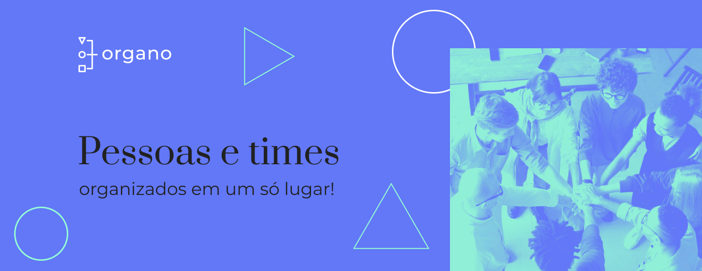

# Organo

   
  
Hey there, welcome! 
  I'm Clécio Souza, Front End developer & Ui Designer from <b>Barueri - São Paulo, Brasil</b>.

- 💡  I like to explore new trends and learn new technologies.
- 🌱 I'm currently learning more about Nuxt.js, Tailwind CSS and React.
- ❤ Family, Tech & Coding

## 👨🏻‍💻 &nbsp;Nesse projeto foram utilizados ##

   
  
  
    
  
  

## 🌎 &nbsp;Where to find me ##

  <a href="https://www.cleciosouza.com" target="_blank"> cleciosouza.com</a>

  
   
  

